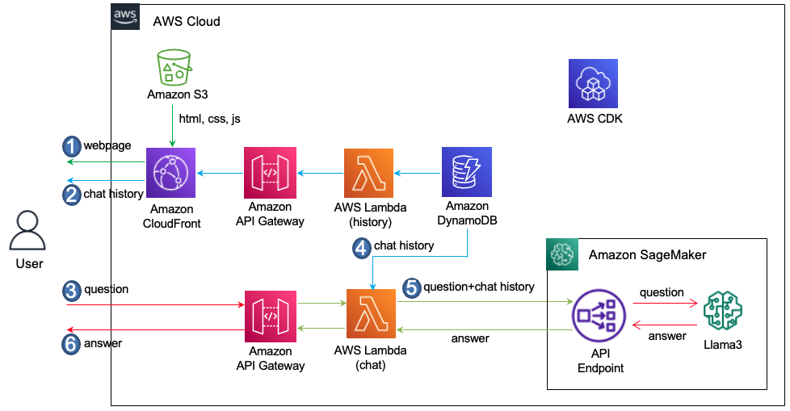

# Llama3와 LangChain을 이용하여 한국어 Chatbot 만들기

https://hits.seeyoufarm.com/api/count/incr/badge.svg?url=https%3A%2F%2Fgithub.com%2Fkyopark2014%2Fllama3-langchain-kor&count_bg=%2379C83D&title_bg=%23555555&icon=&icon_color=%23E7E7E7&title=hits&edge_flat=false


여기서는 LLM으로 Llama3를 이용하여 한국어 Chatbot을 만드는 것을 설명합니다. 개발은 LangChain을 활용하였습니다. 전체적인 Architecture는 아래와 같습니다.



## 주요 구성

SageMaker Endpoint로 LLM을 사용하기 위하여 ContentHandler를 정의합니다. 

```python
from langchain.llms.sagemaker_endpoint import LLMContentHandler

class ContentHandler(LLMContentHandler):
    content_type = "application/json"
    accepts = "application/json"
    
    def transform_input(self, prompt: str, model_kwargs: Dict) -> bytes:
        input_str = json.dumps(
        {
            "inputs": prompt, 
            "parameters": model_kwargs}
        )
        return input_str.encode("utf-8")

    def transform_output(self, output: bytes) -> str:
        response_json = json.loads(output.read().decode("utf-8"))
        print('response_json: ', response_json)
        return response_json["generated_text"]

content_handler = ContentHandler()
```

boto3 client에서는 service로 "sagemaker-runtime"을 사용학고, 아래와 같이 parameter도 정의할 수 있습니다. 이후 LangChain의 SagemakerEndpoint를 이용해 llm을 정의합니다.

```python
from langchain_community.llms import SagemakerEndpoint

def initiate_LLM():
    sagemaker_client = boto3.client(
        service_name="sagemaker-runtime",
        region_name=aws_region,
    )
    parameters = {
        "max_new_tokens": 1024, 
        "top_p": 0.9, 
        "temperature": 0.1,
        "stop": "<|eot_id|>"
    } 

    llm = SagemakerEndpoint(
        endpoint_name = endpoint_name, 
        region_name = "us-west-2", 
        model_kwargs = parameters,
        client = sagemaker_client,
        endpoint_kwargs={"CustomAttributes": "accept_eula=true"},
        content_handler = content_handler
    )    
    return llm
```

채팅이력을 포함하여 답변을 구하기 위하여 아래와 같이 prompt를 구성합니다. 상세한 코드는 [lambda-chat](./lambda-chat-ws/lambda_function.py)을 참조합니다. 
    
```python
def general_conversation(query):
    prompt_template = """
    <|begin_of_text|>
        <|start_header_id|>system<|end_header_id|>\n\n다음의 History는 User와 Assistant의 이전 대화입니다. History를 참조하여 Qustion에 대해 친절히 답변하세요. Always answer without emojis in Korean
        History: {chat_history}<|eot_id|>
        <|start_header_id|>user<|end_header_id|>\n\n"{text}"<|eot_id|>
        <|start_header_id|>assistant<|end_header_id|>\n\n"""
    
    PROMPT = PromptTemplate(
        template=prompt_template, 
        input_variables=["chat_history", "text"]
    )
    
    history = memory_chain.load_memory_variables({})["chat_history"]
    print('memory_chain: ', history)
    
    chat_history = get_chat_history(history)
    print('chat_history: ', chat_history)
    
    llm_chain = LLMChain(llm=llm, prompt=PROMPT)
    
    msg = llm_chain({"text": query, "chat_history": chat_history}, return_only_outputs=True)
    
    return msg['text']  
```

### 대화 이력의 관리

map_chain을 설정합니다. 

```python
map_chain = dict() 
MSG_LENGTH = 100
```

event가 lambda에 전달될때에 userId를 추출하여 관련된 대화이력을 memory_chain에서 확인합니다. 없는 경우에는 LangChain의 ConversationBufferWindowMemory을 이용해 memory_chain을 설정합니다. 또한 DyanmoDB를 조회하여 이전 대화이력이 있는 경우에 로드 합니다.

```python
# create memory
if userId in map_chain:  
    memory_chain = map_chain[userId]
    print('memory_chain exist. reuse it!')
else: 
    memory_chain = ConversationBufferWindowMemory(memory_key="chat_history", output_key='answer', return_messages=True, k=4)
    map_chain[userId] = memory_chain
    print('memory_chain does not exist. create new one!')

    allowTime = getAllowTime()
    load_chat_history(userId, allowTime)◊

def load_chat_history(userId, allowTime):
    dynamodb_client = boto3.client('dynamodb')
    print('loading history.')

    try: 
        response = dynamodb_client.query(
            TableName=callLogTableName,
            KeyConditionExpression='user_id = :userId AND request_time > :allowTime',
            ExpressionAttributeValues={
                ':userId': {'S': userId},
                ':allowTime': {'S': allowTime}
            }
        )
        print('query result: ', response['Items'])
    except Exception:
        err_msg = traceback.format_exc()
        print('error message: ', err_msg)                    
        raise Exception ("Not able to request to DynamoDB")

    for item in response['Items']:
        text = item['body']['S']
        msg = item['msg']['S']
        type = item['type']['S']

        if type == 'text':
            memory_chain.chat_memory.add_user_message(text)
            if len(msg) > MSG_LENGTH:
                memory_chain.chat_memory.add_ai_message(msg[:MSG_LENGTH])                          
            else:
                memory_chain.chat_memory.add_ai_message(msg)
```

신규 대화 이력은 아래와 같이 저장합니다.

```python
memory_chain.chat_memory.add_user_message(text)
memory_chain.chat_memory.add_ai_message(msg)
```

## 직접 실습 해보기

### 사전 준비 사항

이 솔루션을 사용하기 위해서는 사전에 아래와 같은 준비가 되어야 합니다.

- [AWS Account 생성](https://repost.aws/ko/knowledge-center/create-and-activate-aws-account)에 따라 계정을 준비합니다.

### CDK를 이용한 인프라 설치

본 실습에서는 Seoul 리전 (ap-northeast-2)을 사용합니다. [인프라 설치](./deployment.md)에 따라 CDK로 인프라 설치를 진행합니다. 

## 실행결과

입력창에 "서울 여행하는 방법 알려줘"로 입력후 결과를 확인합니다.


[error_code.pdf](./contents/error_code.pdf)을 다운받은 후에 업로드를 하고 결과를 확인합니다.


작은 모델이라서 Hallucination은 피할수 없는것 같습니다. 사용 목적에 맞는 Prompt를 기반으로 RAG와 결합하여 써야 할것 같습니다.


## 리소스 정리하기 

더이상 인프라를 사용하지 않는 경우에 아래처럼 모든 리소스를 삭제할 수 있습니다. 

1) [API Gateway Console](https://us-west-2.console.aws.amazon.com/apigateway/main/apis?region=us-west-2)로 접속하여 "rest-api-for-llama3-langchain-kor", "ws-api-for-llama3-langchain-kor"을 삭제합니다.

2) [Cloud9 Console](https://us-west-2.console.aws.amazon.com/cloud9control/home?region=us-west-2#/)에 접속하여 아래의 명령어로 전체 삭제를 합니다.


```text
cd ~/environment/llama3-langchain-kor/cdk-llama3-korg/ && cdk destroy --all
```

## 결론

LangChain을 이용하여 Llama3로 한국어 Chatbot을 만들었습니다. Llama2에서는 지원하지 않던 한국어가 괜찮은 성능으로 제공되고 있으며, 문서 요약 성능도 우수한것으로 보여집니다. 추가 테스트를 통해 활용방안을 확인할 예정입니다.
